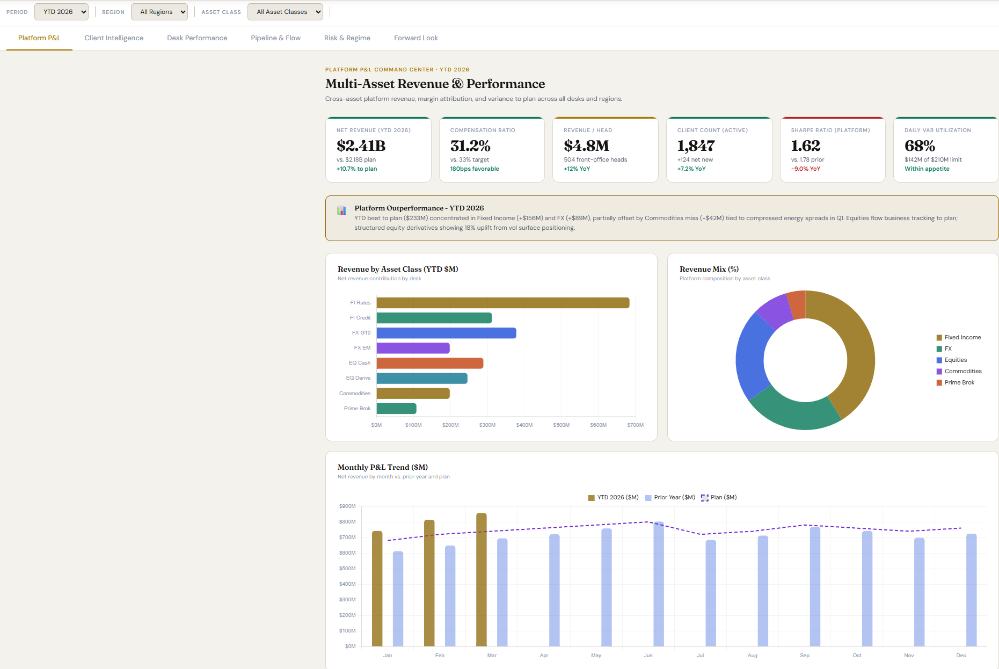
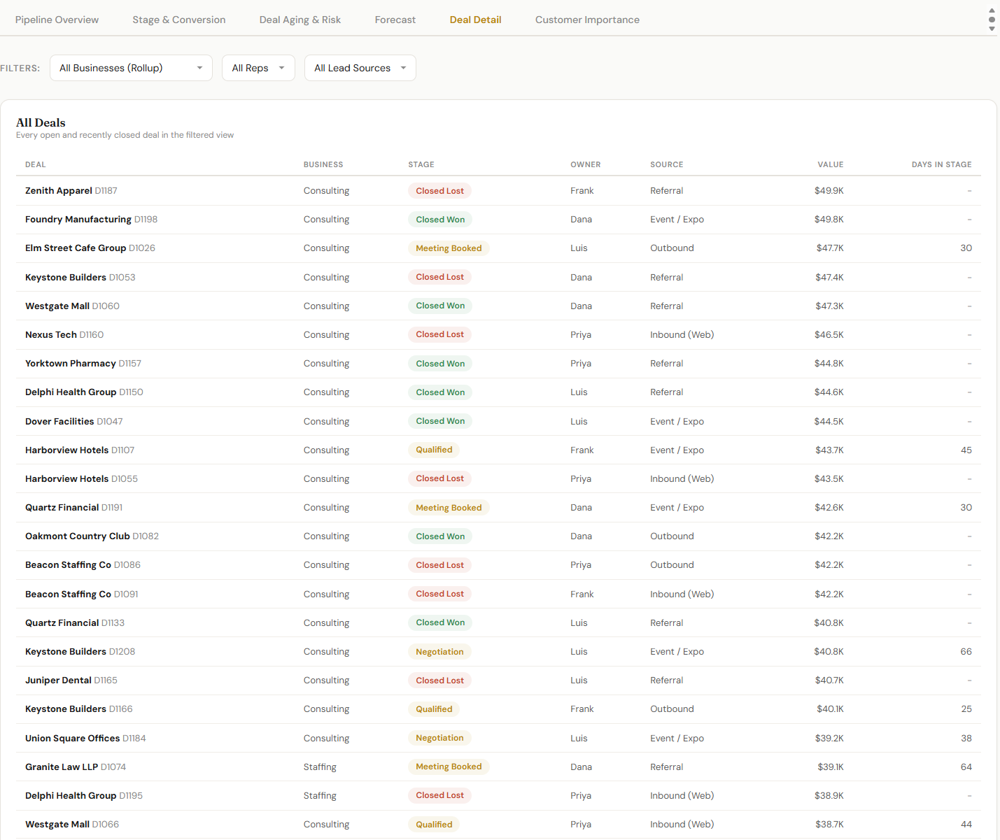
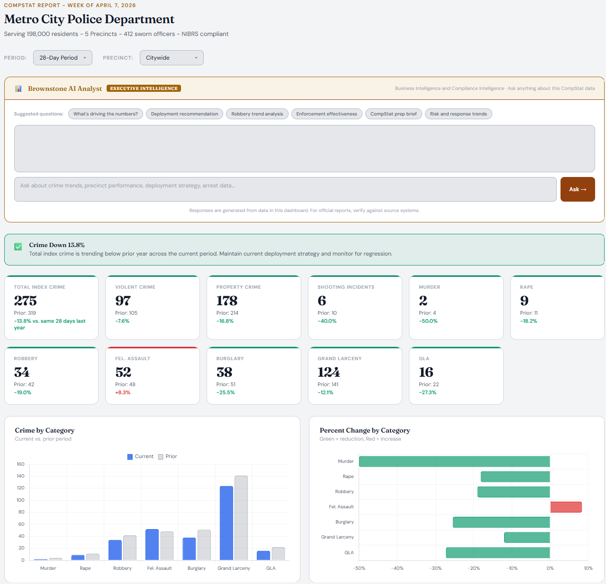
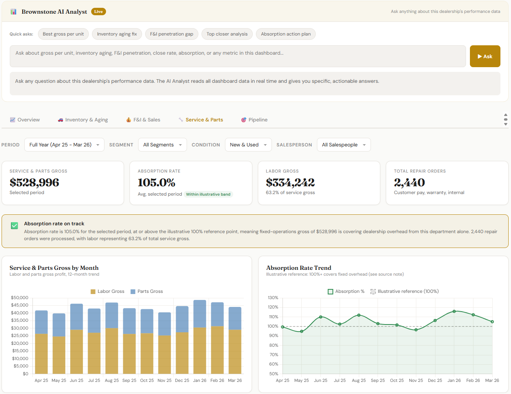
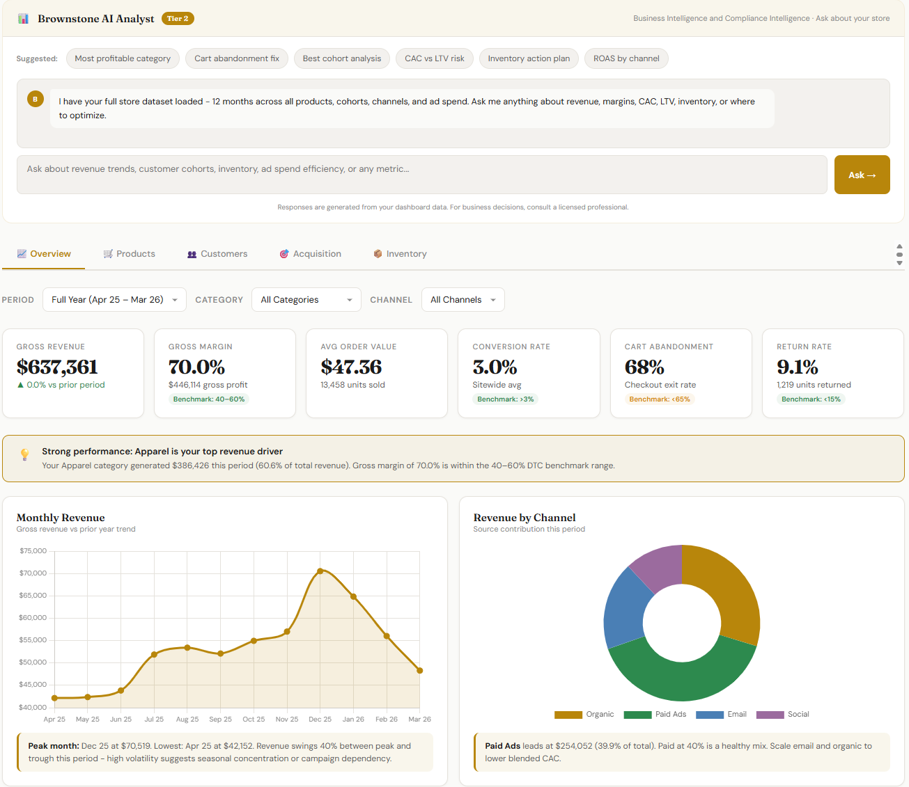
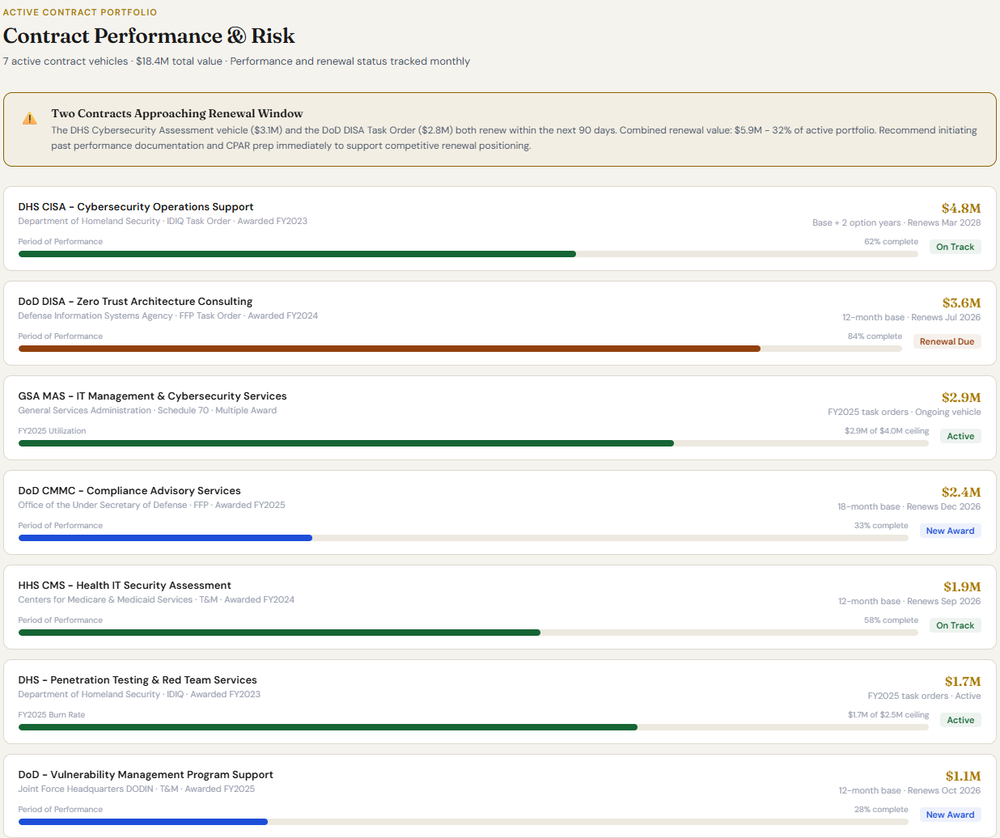

# Paul Brown — Business Intelligence & Analytics Portfolio

Interactive decision dashboards built for small and growing businesses. Each one turns raw operational data into the KPIs and answers an owner actually needs to act on. Built with HTML, JavaScript, and a seeded data model, with light and dark theming and filter-driven KPIs that update across every chart and table.

**Founder & Principal, Brownstone Analytics** | NYC Metro / Westchester, NY
Former Amazon and Mastercard finance professional. Google Data Analytics, Google Business Intelligence, and Microsoft Power BI certified.

Click any dashboard to open the live, interactive demo.

---

## Selected Work

### Multi-Asset Platform Sales & Trading

Institutional sales and trading intelligence across fixed income, FX, equities, commodities, and prime brokerage. Cross-asset P&L with plan variance, client wallet share and profitability, risk-adjusted desk performance with VaR utilization and Sharpe ratios, RFQ win rates, and a six-month predictive forecast with adjustable scenario assumptions. Tabs for platform P&L, client intelligence, desk performance, pipeline and flow, risk and regime, and forward look.

### Sales Pipeline Intelligence

Executive pipeline view with stage analysis, deal aging, and forecasting. Tracks where revenue is stuck, which deals are slipping, and what the quarter is likely to close at. Tabs for executive summary, stages, aging, forecast, and deal detail.

### CompStat Public Safety Analytics

Crime and enforcement analytics modeled on the CompStat approach. Tracks total index crime, violent and property crime, shooting incidents, and felony arrests, broken out by precinct with trend and community views. Tabs for overview, precinct, trends, enforcement, and community.

### Auto Dealership Operations

Units sold, gross per unit, and total gross profit alongside inventory health and days on lot. Combines front-end sales, F&I, and service performance in one view. Tabs for overview, inventory, F&I, service, and pipeline.

### E-Commerce / Shopify

Gross revenue, gross margin, average order value, and conversion rate with cart abandonment and return tracking. Connects store performance to product, customer, and acquisition data. Tabs for overview, products, customers, acquisition, and inventory.

### Government Contracting

Contract pipeline, compliance readiness, and performance tracking built for the government contracting environment. Focused on readiness and data discipline rather than procurement strategy.

---

## How These Are Built

- Filter-driven: every filter visibly changes the KPIs, charts, and tables. Nothing is cosmetic.
- Light and dark modes on every board.
- Deterministic seeded data so the numbers stay consistent across views.
- Per-chart insights that pair a specific number with a specific recommended action.

---

## Contact

**Paul Brown**
Brownstone Analytics
pb@brownstoneanalytics.org
[brownstoneanalytics.org](https://www.brownstoneanalytics.org)
